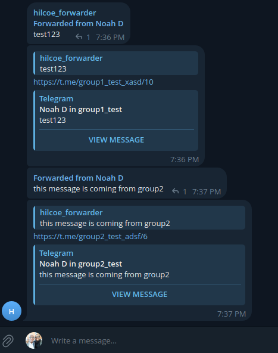

# hilcoe_forwarder
A telegram bot that forwards messages to a HiLCoE group. 

In HiLCoE each course has its own specific telegram group. This is 
good, for separation of subjects but it makes the life of students a bit harder. 

For example if a student is taking 6 courses, there he has to check 
6 different groups in order to be on track. 

This bot tries to solve that problem, by forwarding all messages from those 6 groups
to a single group. That way the student can only follow a single group and mute the others
if he/she sees fit. 



## Want to contribute? 

Feel free to reach out to me: https://t.me/data53 or create an issue. 

Pull requests are also appreciated. 

## Want to use the bot for your own groups? 

Step 1: Talk to BotFather to create a telegram bot: https://t.me/BotFather

Step 2: Create your own `config.json` file: 

```
{ 
    "api_key": "get-this-from-bot-father", 
    "source_groups": [
        "group-username-1", 
        "group-username-2"
    ], 
    "destination_groups": [ 
        chat-id-must-be-in-integer-form
    ], 
    "secret_token": "randomly-generate-a-token-and-place-it-here", 
    "webhook_url": "https://example.org"
}
```